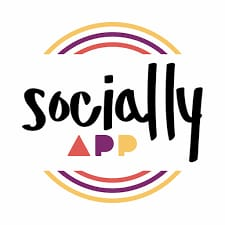

<!-- Hero -->
<h1 align="center">Hi 👋, I'm Shashwat Tripathi</h1>

<em>Full-Stack Developer · AI/ML Enthusiast · Builder of Realtime Apps</em>

  <a href="mailto:tshashwat093@gmail.com">✉️ Email</a> ·
  <a href="https://www.linkedin.com/in/shashwat-tripathi-83a156282">LinkedIn</a> ·
  <a href="https://github.com/shashwat0010">GitHub</a>

---

## 🔎 About Me
- 🎓 **B.Tech, Electronics & Communication Engineering**, NIT Silchar (CGPA: **7.72**)
- 🔭 Currently building **full-stack & AI-powered apps**
- 🤝 Looking to collaborate on **AI, RAG systems, and scalable backend projects**
- ⚡ Fun fact: Won **Adobe India Hackathon** building a CPU-only offline PDF outline extraction system
- 💬 Ask me about **LLM integration, realtime backend architectures, cloud deployments**

---

## 🛠️ Skills
**Languages:** C++, C, Python, JavaScript, TypeScript, MATLAB, HTML, CSS  
**Frameworks / Tools:** React, Next.js, Node.js, Express, MongoDB, PostgreSQL, Prisma, FastAPI, JWT, Tailwind, Chakra UI, Docker, Git, Razorpay, WebSockets  
**ML/AI:** Scikit-learn, Pandas, TensorFlow, Keras  
**Others:** OOP, Operating Systems, Networking, DSA

---

## 🚀 Projects Showcase

### 1️⃣ Streamify — Real-Time Video Chat

  
  

**What it does:**  
Full-stack realtime chat + video calling with friend management and online presence tracking.

**Tech Stack:** React · Node.js · MongoDB · Zustand · TailwindCSS · GetStream API

**Impact:**  
- Enabled smooth HD video calls with <200ms latency  
- Push notifications for messages & friend requests

**Links:**  
<a href="https://github.com/shashwat0010/streamify">
   GitHub
</a> · 
[🌐 Live Demo](https://streamify-chat-app-1.onrender.com/)

---

### 2️⃣ MedManage — Hospital Management System

  
  

**What it does:**  
Hospital management system with AI chatbot support, optimized patient booking, and role-based access.

**Tech Stack:** React · Node.js · Express · MongoDB · JWT · Chakra UI · WebSockets

**Impact:**  
- Reduced unauthorized access by **43%**  
- Halved patient support response time  
- 5× concurrent booking capacity

**Links:**  
<a href="https://github.com/jaiswaldev/Zee-Hospital-Management.git">
   GitHub
</a>

---

### 3️⃣ Socially — Next.js Social Media Platform

  
  

**What it does:**  
A Next.js + PostgreSQL social platform with Clerk authentication and dynamic server components.

**Tech Stack:** Next.js · PostgreSQL · Prisma · Clerk · Tailwind

**Links:**  
<a href="https://github.com/shashwat0010/socially">
   GitHub
</a>

---

### 4️⃣ CBI Banking Gateway

  
  

**What it does:**  
Banking gateway app with Razorpay integration and real-time balance updates.

**Impact:**  
- Increased operational efficiency by **30%**  
- Implemented secure payment gateway with Razorpay

**Tech Stack:** React · Node.js · MongoDB · Razorpay API

**Links:**  
<a href="https://github.com/shashwat0010/banking-gateway-app">
   GitHub
</a>

---

## 💼 Internship & Experience
- **Satyendra Nath Bose Research Intern — NIT Silchar**  
  - Built MedManage (MERN) with AI chatbot, WebSocket-powered bookings  
  - Reduced unauthorized access by **43%**, halved patient support time

---

## 🏆 Achievements
- Solved **600+** problems on LeetCode, GfG, and Codeforces
- Winner, **Adobe India Hackathon** — built offline PDF outline extractor
- Member, **Coding Club NIT Silchar** — curated problem sets & mentoring

---

## 📊 GitHub Stats

---

## 📫 Contact Me
- 📧 Email: tshashwat093@gmail.com  
- 📱 Phone: +91-83035-35593  
- 💼 LinkedIn: [Shashwat Tripathi](https://www.linkedin.com/in/shashwat-tripathi-83a156282)  
