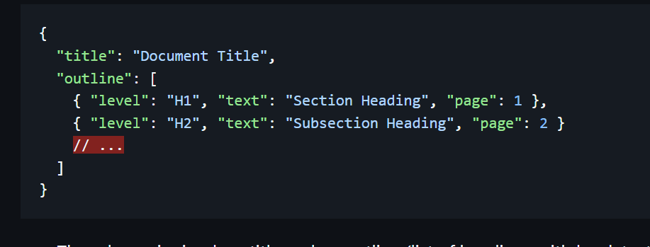

<!-- Hero -->
<h1 align="center">Hi 👋, I'm Shashwat Tripathi</h1>

<em>Full-Stack Developer · AI/ML Enthusiast · Builder of Realtime Apps</em>

  <a href="mailto:tshashwat093@gmail.com">✉️ Email</a> ·
  <a href="https://www.linkedin.com/in/shashwat-tripathi-83a156282">LinkedIn</a> ·
  <a href="https://github.com/shashwat0010">GitHub</a>

---

## 🔎 About Me
- 🎓 **B.Tech, Electronics & Communication Engineering**, NIT Silchar
- 🔭 Currently building **full-stack & AI-powered apps**
- 🤝 Looking to collaborate on **AI, RAG systems, and scalable backend projects**
- ⚡ Fun fact: Built a CPU-only offline PDF outline extraction system in **Adobe India Hackathon**
- 💬 Ask me about **full-stack web development, real-time backend architectures, and cloud deployments**

---

## 🛠️ Tech Stack (Overview)

### 💻 Languages

  
  
  
  
  
  
  
  

### ⚙️ Frameworks & Libraries

  
  
  
  
  
  
  
  

### 🗄 Databases & Cloud

  
  
  
  
  
  

### 🤖 Machine Learning

  
  
  
  

---
---

## 🐍 Snake Game Contribution Graph

  

---

## 🚀 Projects Showcase

### 1️⃣ Streamify — Real-Time Video Chat

  
  

Full-stack realtime chat + video calling with friend management and online presence tracking.

**Tech Stack:** React · Node.js · MongoDB · Zustand · TailwindCSS · GetStream API  
**Impact:** Enabled smooth HD video calls with <200ms latency. Push notifications for messages & friend requests.  
**Links:**  · [🌠Live Demo](https://streamify-chat-app-1.onrender.com/)

---

### 2️⃣ MedManage — Hospital Management System

  
  

Hospital management system with AI chatbot support, optimized patient booking, and role-based access.

**Tech Stack:** React · Node.js · Express · MongoDB · JWT · Chakra UI · WebSockets  
**Impact:** Reduced unauthorized access by **43%**, halved patient support time, and increased booking concurrency 5×.  
**Links:** 

---

### 3️⃣ Socially — Next.js Social Media Platform

  
  

A Next.js + PostgreSQL social platform with Clerk authentication and dynamic server components.

**Tech Stack:** Next.js · PostgreSQL · Prisma · Clerk · TailwindCSS  
**Links:** 

---

### 4️⃣ CBI Banking Gateway

  
  

Banking gateway app with Razorpay integration and real-time balance updates.

**Tech Stack:** React · Node.js · MongoDB · Razorpay API  
**Impact:** Increased operational efficiency by **30%** and implemented secure payment gateway with Razorpay.  
**Links:** 

---

### 5️⃣ Adobe India Hackathon — Offline PDF Outline Extractor

  
  

Offline CPU-based PDF outline extraction system for low-resource environments.

**Tech Stack:** Python · PyMuPDF · Tkinter  
**Impact:** Enabled instant PDF outline generation without internet access; optimized for low-memory systems.  
**Links:** 

---

## 🏆 Achievements
- Solved **600+** problems on LeetCode, GfG, and Codeforces
- Amongst the top 20% finalist in **Adobe India Hackathon**
- Member, **Coding Club NIT Silchar**

---

## 📊 GitHub Stats
  

